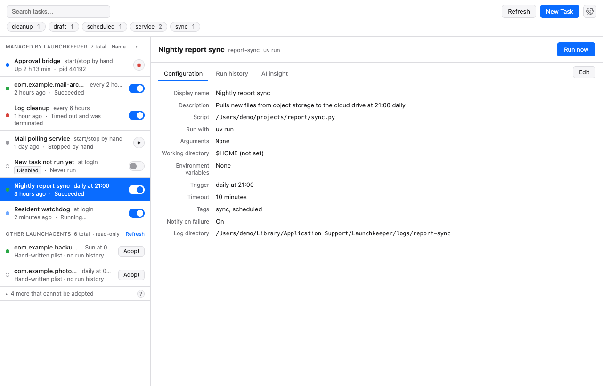
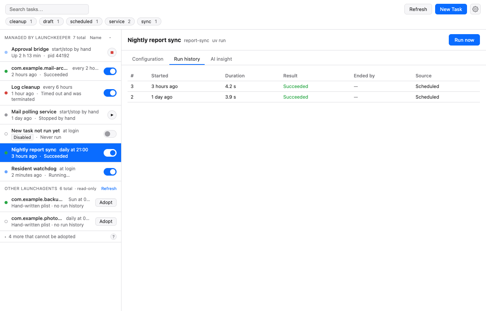
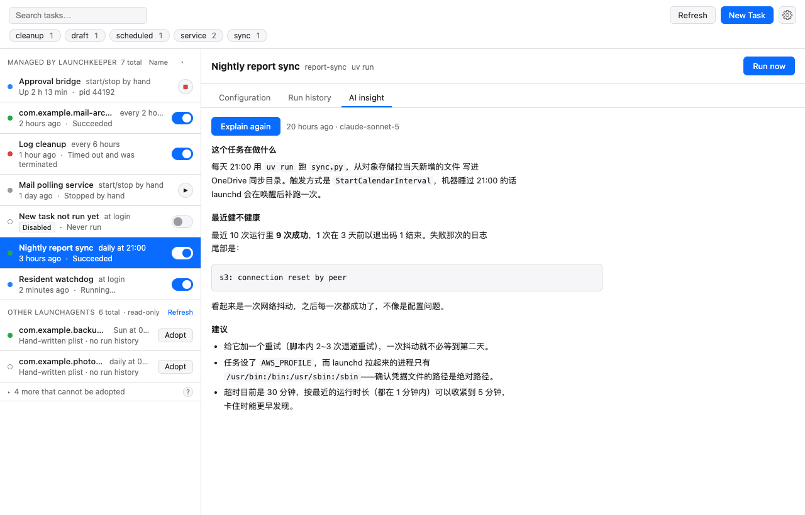
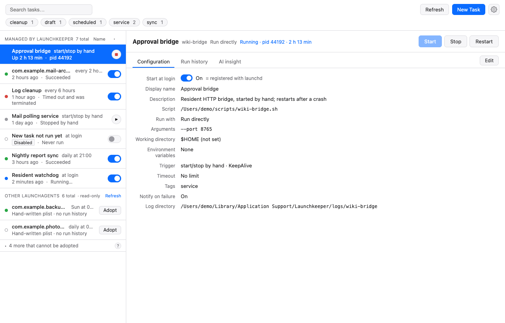
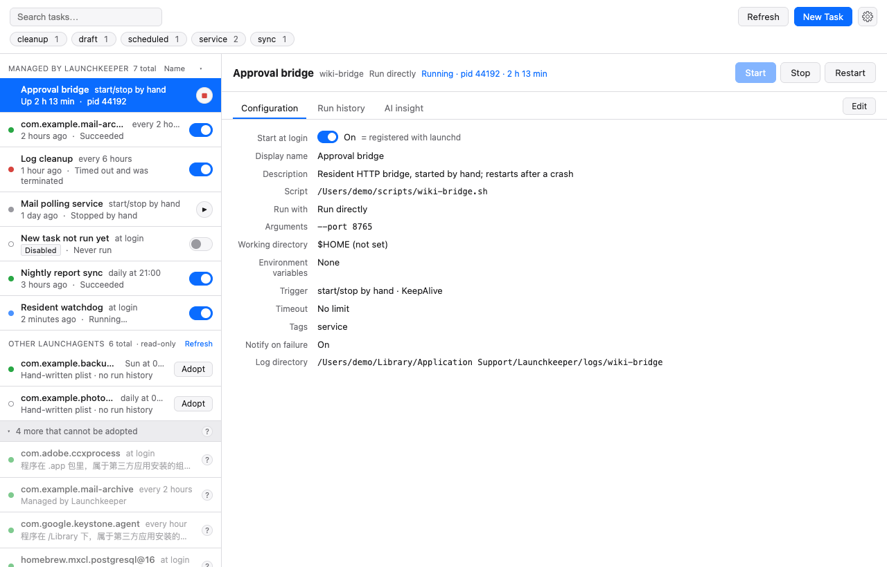
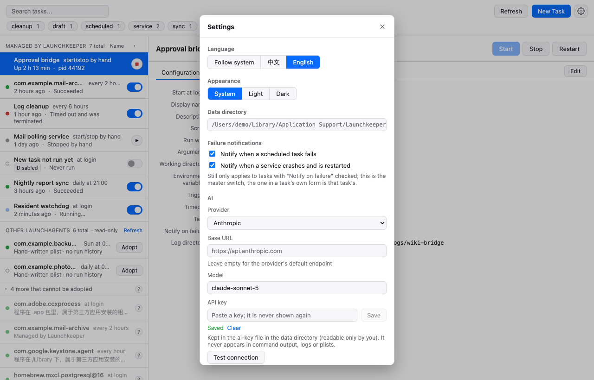
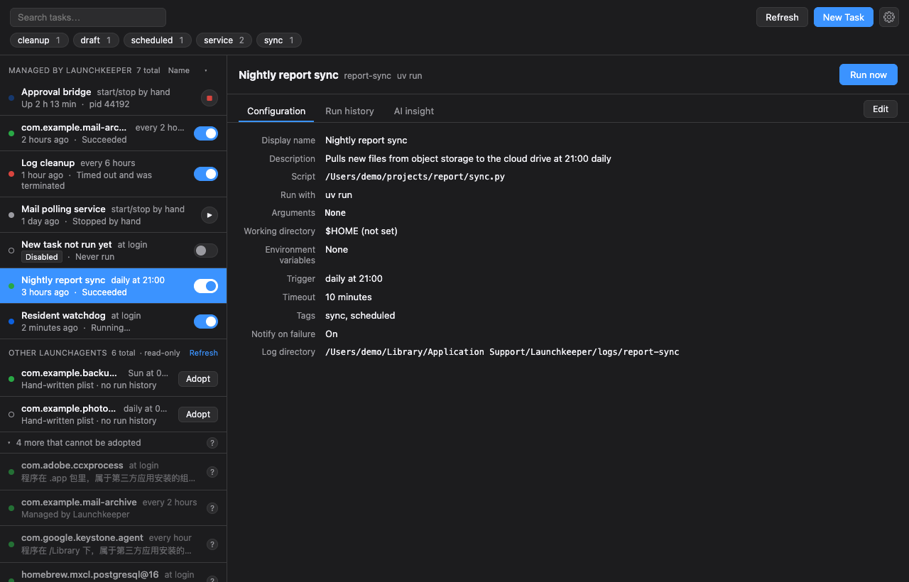
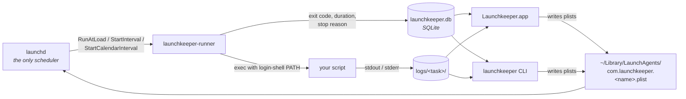

# Launchkeeper

English | [简体中文](README.zh-CN.md)

**See every scheduled script on your Mac, why it failed, and how long it ran — without hand-editing a single plist.**



Launchkeeper is a native macOS app (plus a first-class CLI) for managing `launchd`-based automation: cron-like scripts, login items, and long-running background services. It doesn't replace the scheduler — `launchd` still does all the actual scheduling — it gives you a UI, a run history, and logs on top of it.

## Why Launchkeeper

**`launchd` is the only scheduler, and nothing of ours stays resident.**
Every trigger rule you pick — at login, every N minutes, daily/weekly/monthly at a time — is translated into a real launchd plist key (`RunAtLoad`, `StartInterval`, `StartCalendarInterval`). There is no Launchkeeper daemon, no timer loop, no menu-bar process that has to stay alive. **Quit the app and your tasks keep running**, because they were never running inside the app to begin with. Uninstalling Launchkeeper leaves plists that launchd still understands.

**Every run is recorded — not just "it ran".**
A task's plist never points at your script directly; it points at `launchkeeper-runner`, a thin binary that executes the script and writes down what happened: start time, **exit code**, **duration**, **stop reason** (clean exit, signal, timeout kill), and the full stdout/stderr of that specific run. No more `>> ~/some.log 2>&1` and grepping by timestamp. Runs that exceed `--timeout` are killed and recorded with exit code 124 instead of hanging forever.

**Services, not just schedules.**
A task can be a *service*: a long-running process with no schedule that you **start / stop / restart** from the app, the tray menu, or the CLI. Turn on keep-alive and launchd restarts it when it crashes — and Launchkeeper tells you it did, instead of letting it silently bounce.

**Adopt the plists you already hand-wrote — in place.**
Launchkeeper lists every LaunchAgent in `~/Library/LaunchAgents`, not only its own, and can start/stop/run any of them. For your own hand-written ones it offers **adopt**: the label and the file path stay exactly as they are, the original is copied to `<plist>.bak` first, and only `ProgramArguments` is rewritten to go through the runner. From then on that job has run history and logs like any other task. Shows you the key-by-key diff before writing (`--dry-run`), and **`unadopt` restores the `.bak`**. Anything that isn't clearly a user script — apps, `.app` bundles, Homebrew services — stays strictly read-only.

**It figures out how to run your script.**
Point it at `report.py` and it scans your login shell's `PATH`, the project directory, and the file's shebang to offer the right interpreter: a project `.venv/bin/python`, `uv run` when it sees `pyproject.toml` + `uv.lock`, `node`/`bun`/`deno` for a `package.json`, or launchd's own exec. It also fixes the classic first plist bug: launchd gives your process a minimal `PATH` with no Homebrew in it, and the runner injects your real login-shell `PATH`.

**Failure notifications.**
A macOS notification when a scheduled run exits non-zero or times out, and when a keep-alive service crash-restarts. Each kind has a global toggle, and any single task can opt out.

**AI insight that you pay for once.**
Ask the configured model what a task actually does, whether it's been healthy, and why last night's run failed. The answer is **stored per task** and shown again instantly next time — regenerating costs an explicit `--refresh` / button press. What's sent is the task definition, the last 10 runs, and the tail of the newest log; **environment variable values are never sent**, only their names.

**Bilingual UI, light and dark.**
English and Chinese, following the system language by default, switchable in Settings with no restart. Light, dark, or follow-system appearance.

**A CLI built for scripts and AI agents.**
`launchkeeper` is not an afterthought wrapper — it's the same core the app uses, with a stable `--json` shape on every command, subcommand aliases (`ls` / `rm` / `on` / `off` / `st` / `log`), shell completion that completes task names, and documented exit codes. `launchkeeper docs` prints the entire CLI reference from inside the binary (no checkout needed), and `launchkeeper ai-prompt` prints a ready-to-paste system prompt so an assistant can drive it correctly on the first try.

## Features

- **Task list** — name, trigger rule in plain language, last-run status, enable/disable switch, tags, search.
- **Five trigger shapes** — at login, fixed interval, daily (several times a day), weekly, monthly.
- **Service tasks** — manual start/stop/restart, optional `KeepAlive` crash restart, live status (running / stopped / restarting) with pid and uptime.
- **Run history** — start time, exit code, duration and stop reason for every run.
- **Per-run logs** — stdout and stderr for each individual run, in the app or via `launchkeeper logs`, with a live tail while a task is running.
- **External agents** — every other LaunchAgent listed read-only, startable/stoppable, adoptable when it's safe to adopt.
- **Adopt / unadopt** — in-place takeover with a `.bak` backup and a full undo.
- **Interpreter detection** — `uv run`, project `.venv`, `node`, `bun`, `deno`, shebang, or launchd exec.
- **Failure notifications** — per-kind global toggles and a per-task opt-out.
- **AI insight** — one stored explanation per task, Markdown-rendered, `--refresh` to regenerate.
- **Menu-bar tray** — status at a glance, trigger or start/stop your favourite tasks without opening the window.
- **AI-friendly CLI** — `--json` everywhere, `launchkeeper docs`, `launchkeeper ai-prompt`, `launchkeeper plist <name>` to see the exact XML launchd would load.

## Screenshots

| | |
|---|---|
| **Task detail** — read-only summary of what launchd will actually do<br> | **Run history** — exit code, duration, stop reason<br> |
| **AI insight** — one stored explanation per task<br> | **Service task** — start / stop / restart, keep-alive<br> |
| **External agents** — everything else in `~/Library/LaunchAgents`<br> | **Settings** — language, appearance, notifications, AI<br> |

Dark mode:



## Install

> **Available with the first release.** Until then, [build from source](#build-from-source).

**App (dmg)** — download the latest `Launchkeeper.dmg` from [Releases](https://github.com/code-better-life/launchkeeper/releases) and drag it to `/Applications`.

**Homebrew**

```bash
# the app
brew install --cask code-better-life/launchkeeper/launchkeeper

# just the CLI (launchkeeper + launchkeeper-runner + shell completions)
brew install code-better-life/launchkeeper/launchkeeper
```

### First launch: the app is ad-hoc signed

There is no Apple Developer ID certificate behind these builds yet, so macOS Gatekeeper will refuse to open the app on a double-click. Once, right after installing, either **right-click the app → Open** and confirm, or strip the quarantine attribute:

```bash
xattr -d com.apple.quarantine /Applications/Launchkeeper.app
```

Homebrew users can do it in one step with `brew install --cask --no-quarantine code-better-life/launchkeeper/launchkeeper`.

One consequence worth knowing: macOS ties privacy (TCC) grants — Desktop, Documents, external volumes — to the exact binary launchd executes. Without a stable Developer ID signature, **rebuilding or moving `launchkeeper-runner` can trigger a fresh permission prompt** the next time an enabled task fires. A signed and notarized release is on the roadmap and will make those grants stick.

## Quick start

### CLI

| Command | What it does |
|---|---|
| `launchkeeper add <name> --script <path> <trigger>` | Create a task (`-d` daily, `-e` every, `-w` weekly, `-M` monthly, `-m` manual/service, `--at-login`) |
| `launchkeeper list` (`ls`) | List tasks with trigger, state and last run |
| `launchkeeper show <name>` | Full definition of one task |
| `launchkeeper enable` / `disable` (`on` / `off`) | Register or unregister the job with launchd |
| `launchkeeper run <name>` | Trigger a scheduled task right now |
| `launchkeeper start` / `stop` / `restart <name>` | Control a service task |
| `launchkeeper runs <name>` | Run history: exit code, duration, stop reason |
| `launchkeeper logs <name>` (`log`) | stdout/stderr of a past run (`--last N`, `--err`, `--tail N`) |
| `launchkeeper status` (`st`) | What's running, what failed, what's next |
| `launchkeeper agents` | Every LaunchAgent on the machine, adoptable or not |
| `launchkeeper adopt <label>` / `unadopt <name>` | Take over a hand-written plist in place, or hand it back |
| `launchkeeper explain <name>` | AI explanation of the task and its recent health |
| `launchkeeper plist <name>` | The exact XML launchd would load |
| `launchkeeper docs` / `ai-prompt` | The full CLI reference / a ready-made assistant prompt |

Add `--json` (`-j`) to any of them for a stable machine-readable shape. Full reference, JSON contracts and exit codes: [docs/CLI.md](docs/CLI.md).

**A daily task, run once immediately to check it works:**

```bash
launchkeeper add daily-report --script ~/bin/report.sh --daily 08:00
launchkeeper enable daily-report
launchkeeper run daily-report          # don't wait until 08:00
launchkeeper runs daily-report --limit 1
launchkeeper logs daily-report --last 1
```

**A service you start and stop by hand, restarted if it crashes:**

```bash
launchkeeper add api-bridge --script ~/bin/bridge.py --manual --keep-alive
launchkeeper enable api-bridge
launchkeeper start api-bridge
launchkeeper status --json
launchkeeper stop api-bridge
```

**Adopt a plist you wrote yourself, see the diff first:**

```bash
launchkeeper agents                          # find the label
launchkeeper adopt com.example.daily --dry-run   # key-by-key diff, writes nothing
launchkeeper adopt com.example.daily             # backs up to <plist>.bak, then rewrites
launchkeeper unadopt com.example.daily           # restores the .bak
```

**Ask why it failed:**

```bash
launchkeeper ai config --provider anthropic --model claude-sonnet-5
echo "$MY_API_KEY" | launchkeeper ai key set
launchkeeper ai test
launchkeeper explain daily-report            # stored; free to read again
launchkeeper explain daily-report --refresh  # regenerate
```

### App (development)

```bash
pnpm -C crates/launchkeeper-app install
pnpm -C crates/launchkeeper-app tauri dev
```

## How it works



Three rules follow from that diagram, and they are the whole design:

- **`launchd` is the only scheduler.** Launchkeeper never runs its own timer loop or background daemon. Close the app; the schedule is in launchd's hands.
- **The runner is mandatory.** `ProgramArguments` always points at `launchkeeper-runner`, never at your script — that is what makes run history and per-run logs possible at all.
- **The launchd job is the source of truth; SQLite only holds what launchd has no place for** — descriptions, tags, run history, logs. Whether a task is enabled is read back from launchd, not from the database.

Launchkeeper writes only plists it owns: the `com.launchkeeper.` prefix, or one carrying the `LaunchkeeperManaged` marker it added during adopt (after backing the original up to `.bak`). Every other LaunchAgent is shown read-only.

## For AI assistants

`launchkeeper` (the CLI binary; its crate is `launchkeeper-cli`) is a first-class, script- and AI-agent-friendly interface to `launchkeeper-core`. Every mutating command plus `list`, `show`, `runs`, `status`, and `logs` has a stable `--json` shape — see [docs/CLI.md](docs/CLI.md) for the full wire contract, exit-code conventions, subcommand aliases, shell completion, and the trigger flag grammar. `plist <name>` prints the exact XML launchd would load, for inspection or debugging by a script or agent.

Two subcommands exist for assistants specifically:

- `launchkeeper docs` prints the whole of `docs/CLI.md`, embedded in the binary at compile time — no checkout needed on the machine.
- `launchkeeper ai-prompt [--lang zh-CN|en]` prints the prompt below, so you never have to retype it.

Paste this into your assistant's system prompt, your `CLAUDE.md`, or the chat:

```
Launchkeeper is installed on this machine: a manager for scheduled tasks and long-running services built on macOS launchd. Its command-line tool is `launchkeeper`.
Before you do anything, run `launchkeeper docs` and read the full CLI reference (subcommands, flags, JSON output shapes).
Conventions:
- Always pass `--json` to read-only commands and parse the structured output; never parse the human-readable text.
- Create a task with `launchkeeper add`: give the script path to `--script` and normally let it infer how to run it; choose the trigger with `-d` (a time of day) / `-e` (an interval) / `-m` (a service you start and stop by hand).
- Before changing anything, run `launchkeeper show <name> --json` to see the current definition; afterwards verify with `launchkeeper runs <name>` and `launchkeeper log <name>`.
- Only touch tasks Launchkeeper manages; the other LaunchAgents that `launchkeeper agents` lists are read-only unless the user asks you to adopt one.
- Ask the user before any destructive operation (rm, unadopt, off).
```

## Data & privacy

Everything Launchkeeper stores lives in one directory, `~/Library/Application Support/Launchkeeper/` by default:

```
launchkeeper.db      SQLite: task metadata, tags, run history, AI explanations
logs/<task>/         stdout and stderr, one pair of files per run
bin/                 the installed copy of launchkeeper-runner
ai.json              non-secret AI settings: provider, base URL, model
ai-key               the API key, file mode 0600
```

Override the location with `--data-dir`, `LAUNCHKEEPER_DATA_DIR`, or a one-line path in `~/.config/launchkeeper/data-dir` (in that order of precedence; `launchkeeper config data-dir` reads and writes the file). The one exception is `~/Library/Logs/Launchkeeper/`, where launchd itself writes the runner's own stdout — launchd refuses to start a job whose `StandardOutPath` is on an external volume, so that path can't follow your data directory.

**Nothing leaves your machine** — there is no telemetry, no crash reporting, no update ping. The single exception is the AI request you configure yourself: `explain` sends the task definition, the last 10 runs, and up to 16 KiB of the newest log tail to *your* endpoint with *your* key. **Environment variable values are never included** — only their names, since that's usually the answer to "why does it work in my shell and fail under launchd". Set `--base-url` to a local Ollama and even that stays on the machine. The API key is written to `<data_dir>/ai-key` with mode 0600 and is read from stdin, never from a command line where it would land in shell history and `ps` output.

## Build from source

Requires Rust stable (edition 2024) and, for the app, Node 22 with pnpm.

```bash
git clone https://github.com/code-better-life/launchkeeper.git
cd launchkeeper

# CLI + runner
cargo build --release --workspace
# -> target/release/launchkeeper and target/release/launchkeeper-runner
#    (the CLI finds the runner as a sibling binary, or via --runner / LAUNCHKEEPER_RUNNER)

# the desktop app
pnpm -C crates/launchkeeper-app install
pnpm -C crates/launchkeeper-app tauri build
```

Layout:

```
crates/launchkeeper-core/     Task model, plist generation, launchctl wrapper, SQLite storage
crates/launchkeeper-runner/   The thin binary launchd starts: runs the script, captures logs, records the result
crates/launchkeeper-cli/      The launchkeeper binary (crate name unchanged: launchkeeper-cli)
crates/launchkeeper-app/      Tauri 2 desktop app (Rust backend + Svelte frontend)
docs/                         PRD and design docs
```

Before sending anything: `cargo fmt`, `cargo clippy -- -D warnings`, and `cargo test --workspace` must all pass.

## Contributing

Issues and pull requests are welcome — bug reports, launchd edge cases you've hit, and translation fixes especially.

- Read [CLAUDE.md](CLAUDE.md) first; it's short and it's where the non-negotiable design rules live (launchd is the only scheduler, the runner is mandatory, only our own plists get written).
- New behaviour comes with tests. `launchkeeper-core` targets 80% coverage.
- **Any test that writes a plist or calls `launchctl` must point `LAUNCHKEEPER_DATA_DIR`, `LAUNCHKEEPER_LAUNCH_AGENTS_DIR` and `LAUNCHKEEPER_RUNNER_LOG_DIR` at a temporary directory**, and use a throwaway label it cleans up. Redirecting the data directory alone is not enough — enabled-state checks read the real `~/Library/LaunchAgents`.
- Commit messages are `<type>: <description>` with type one of `feat` / `fix` / `refactor` / `docs` / `test` / `chore` / `perf` / `ci`.

## Roadmap

- [x] **M1** — Core library, runner and CLI.
- [x] **M2** — Desktop app: task list, detail, run now, log viewer, menu-bar tray.
- [x] **M2.5** — Service tasks: manual start/stop with crash auto-restart.
- [x] **M3** — Interpreter detection, CLI rename and aliases, in-place adopt of existing LaunchAgents, failure notifications, English/Chinese UI.
- [ ] **M3 (remaining)** — Code signing and notarization, Homebrew tap, GitHub Actions.
- [ ] **M4** — AI insight ✅, list sorting, category counts.

## License

MIT — see [LICENSE](LICENSE).

## Support

If Launchkeeper is useful to you, consider buying me a coffee: https://buymeacoffee.com/<TODO-handle>
