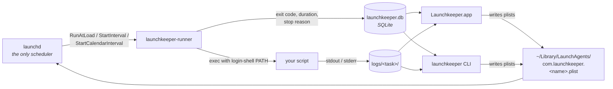

# Launchkeeper

**A native macOS app and CLI for `launchd`-based scheduled scripts and background services. See when every task ran, why it failed, and how long it took, without hand-editing a plist.**

[](https://github.com/code-better-life/launchkeeper/releases/latest)
[](https://github.com/code-better-life/launchkeeper/actions/workflows/ci.yml)


[](LICENSE)

English | [简体中文](README.zh-CN.md)

[Install](#install) · [Quick start](#quick-start) · [Features](#features) · [How it works](#how-it-works) · [For AI assistants](#for-ai-assistants) · [FAQ](#faq) · [CLI reference](docs/CLI.md)


## Why not just cron, or a hand-written plist?

- **Nothing of Launchkeeper stays resident.** Every trigger you pick becomes a real launchd plist key. There is no daemon, no timer loop, no menu-bar process that must stay alive. **Quit the app and your tasks keep running.**
- **Every run is recorded.** Exit code, duration, stop reason (clean exit, signal, timeout) and the full stdout/stderr of that specific run. No more `>> ~/some.log 2>&1` and grepping by timestamp.
- **It works with what you already have.** Every LaunchAgent on the machine is listed. The ones you hand-wrote can be adopted in place, with a `.bak` backup and a one-command undo.
- **The CLI is a first-class citizen.** Same core as the app, `--json` on every command, and a built-in reference an AI assistant can read with `launchkeeper docs`.

## Install

Requires macOS 13 Ventura or later. The prebuilt app is Apple Silicon only; the Homebrew formula builds the CLI from source on any Mac.

**Homebrew**

```bash
# the app (includes the CLI)
brew install --cask code-better-life/launchkeeper/launchkeeper

# CLI only: launchkeeper + launchkeeper-runner + shell completions
brew install code-better-life/launchkeeper/launchkeeper
```

**Direct download:** grab `Launchkeeper_<version>_aarch64.dmg` or the CLI tarball from [Releases](https://github.com/code-better-life/launchkeeper/releases/latest) and drag the app to `/Applications`.

> **First launch.** Current builds are not yet signed with an Apple Developer ID, so Gatekeeper blocks a plain double-click. Once, either right-click the app and choose **Open**, or run `xattr -d com.apple.quarantine /Applications/Launchkeeper.app`. Homebrew users can pass `--no-quarantine` to the cask install. See the [FAQ](#faq) for what this means for privacy prompts.

## Quick start

**A daily script, run once right now to check it works:**

```bash
launchkeeper add daily-report --script ~/bin/report.sh --daily 08:00
launchkeeper enable daily-report
launchkeeper run daily-report          # don't wait until 08:00
launchkeeper runs daily-report --limit 1
launchkeeper logs daily-report --last 1
```

**A service you start and stop by hand, restarted by launchd if it crashes:**

```bash
launchkeeper add api-bridge --script ~/bin/bridge.py --manual --keep-alive
launchkeeper enable api-bridge
launchkeeper start api-bridge
launchkeeper status
```

**Adopt a plist you wrote yourself, diff first:**

```bash
launchkeeper agents                              # find the label
launchkeeper adopt com.example.daily --dry-run   # key-by-key diff, writes nothing
launchkeeper adopt com.example.daily             # backs up to <plist>.bak, then rewrites
launchkeeper unadopt com.example.daily           # restores the .bak
```

Or do all of the above in the app: **+** to add a task, the switch to enable it, **Run now**, then the **Runs** and **Logs** tabs.

| Command | What it does |
|---|---|
| `add <name> --script <path> <trigger>` | Create a task: `-d` daily, `-e` every N, `-w` weekly, `-M` monthly, `-m` manual/service, `--at-login` |
| `list` / `show <name>` | Tasks with trigger, state and last run / one full definition |
| `enable` / `disable` | Register or unregister the job with launchd |
| `run` / `start` / `stop` / `restart` | Trigger a scheduled task / control a service |
| `runs` / `logs` / `status` | Run history / stdout and stderr of a run / what's running, failed, next |
| `agents` / `adopt` / `unadopt` | Every LaunchAgent on the machine / take one over in place / hand it back |
| `explain` | AI explanation of the task and its recent health |
| `plist` / `docs` / `ai-prompt` | The exact XML launchd loads / the full CLI reference / a ready-made assistant prompt |

Aliases: `ls`, `rm`, `on`, `off`, `st`, `log`. Add `--json` (`-j`) to any command for a stable machine-readable shape. Full reference, JSON contracts and exit codes: [docs/CLI.md](docs/CLI.md).

## Features

**Scheduling**
- Five trigger shapes: at login, fixed interval, daily (several times a day), weekly, monthly. Each maps to `RunAtLoad`, `StartInterval` or `StartCalendarInterval`.
- Trigger rule shown in plain language, with `launchkeeper plist <name>` to see the exact XML.
- Timeouts: a run that exceeds `--timeout` is killed and recorded with exit code 124 instead of hanging.

**Services**
- Long-running processes with no schedule: start / stop / restart from the app, the tray menu, or the CLI.
- Optional `KeepAlive`: launchd restarts a crashed service, and Launchkeeper tells you it did.
- Live status with pid and uptime.

**Run history and logs**
- Start time, exit code, duration and stop reason for every run.
- stdout and stderr per run, with a live tail while the task is running.
- macOS notification on non-zero exit, timeout, or crash-restart. Global toggles per kind, per-task opt-out.

**Your existing LaunchAgents**
- Everything in `~/Library/LaunchAgents` is listed and can be started, stopped, or run.
- Adopt in place: label and path unchanged, original saved as `.bak`, only `ProgramArguments` rewritten. `--dry-run` shows the diff, `unadopt` restores.
- Apps, `.app` bundles and Homebrew services are recognised and kept strictly read-only.

**Running the script correctly**
- Interpreter detection from the login-shell `PATH`, the project directory and the shebang: a project `.venv`, `uv run` when it sees `pyproject.toml` + `uv.lock`, `node` / `bun` / `deno` for a `package.json`, or plain launchd exec.
- The runner injects your real login-shell `PATH`, fixing the classic "works in my terminal, fails under launchd" bug.

**AI insight**
- Ask the configured model what a task does, whether it has been healthy, and why the last run failed.
- One stored answer per task, shown instantly next time. Regenerating needs an explicit `--refresh`.
- Works with Anthropic or any OpenAI-compatible endpoint, including a local Ollama.

**App**
- Menu-bar tray with status at a glance and one-click trigger / start / stop for favourite tasks.
- English UI by default, with Simplified Chinese selectable in Settings. Switching takes effect without a restart. Light, dark, or system appearance.

## Screenshots

| | |
|---|---|
| **Run history**: exit code, duration, stop reason<br> | **Service task**: start / stop / restart, keep-alive<br> |
| **External agents**: everything else in `~/Library/LaunchAgents`<br> | **AI insight**: one stored explanation per task<br> |
| **Settings**: language, appearance, notifications, AI<br> | **Dark mode**<br> |

## How it works



Three rules follow from that diagram, and they are the whole design:

- **`launchd` is the only scheduler.** Launchkeeper never runs its own timer loop or background daemon. Close the app; the schedule is in launchd's hands.
- **The runner is mandatory.** `ProgramArguments` always points at `launchkeeper-runner`, never at your script. That is what makes run history and per-run logs possible at all.
- **The launchd job is the source of truth.** SQLite only holds what launchd has no place for: descriptions, tags, run history, logs. Whether a task is enabled is read back from launchd, not from the database.

Launchkeeper writes only plists it owns: the `com.launchkeeper.` prefix, or one carrying the `LaunchkeeperManaged` marker it added during adopt. Every other LaunchAgent is read-only.

## For AI assistants

The CLI is designed to be driven by an assistant: every command has a stable `--json` shape, exit codes are documented, and the reference lives inside the binary.

```bash
launchkeeper docs          # prints docs/CLI.md, no checkout needed
launchkeeper ai-prompt     # prints a system prompt for your assistant (--lang zh-CN|en)
```

Paste the output of `ai-prompt` into your assistant's system prompt or `CLAUDE.md`. It tells the model to read `launchkeeper docs` first, always use `--json`, verify with `runs` and `logs` after any change, leave non-Launchkeeper agents alone, and ask before destructive operations.

## FAQ

**What happens to my tasks when I quit the app?**
Nothing. They were never running inside the app. launchd keeps the schedule, and the runner keeps writing history, so the app shows everything that happened while it was closed.

**And when I uninstall Launchkeeper?**
The plists it wrote are ordinary LaunchAgents that launchd still understands, but they point at `launchkeeper-runner`, so remove them if you remove the runner. `brew uninstall --zap` does this for you: it boots out every `com.launchkeeper.*` job and deletes the data directory. Adopted jobs keep their original label and are deliberately left alone. Run `launchkeeper unadopt <name>` first to restore them from their `.bak`.

**Why does macOS ask for permission when a task runs?**
macOS ties privacy (TCC) grants for Desktop, Documents and external volumes to the exact binary launchd executes. Until releases carry a stable Developer ID signature, rebuilding or moving `launchkeeper-runner` can trigger a fresh prompt the next time an enabled task fires. Allow it once and it sticks until the binary changes.

**My script works in Terminal but fails under launchd.**
launchd starts processes with a minimal `PATH` (`/usr/bin:/bin:/usr/sbin:/sbin`) and none of your shell's environment. The runner injects your login-shell `PATH`. For anything else, add environment variables to the task, or ask `launchkeeper explain` which lists the variable names it sees.

**Can I keep the data directory on an external disk?**
Yes, via `--data-dir`, `LAUNCHKEEPER_DATA_DIR`, or `launchkeeper config data-dir`. The one exception is `~/Library/Logs/Launchkeeper/`, where launchd itself writes the runner's own stdout. launchd refuses to start a job whose `StandardOutPath` is on an external volume, so that path stays on the internal disk.

**Does it work on Intel Macs?**
The CLI does, built from source by the Homebrew formula or `cargo build`. The prebuilt app is Apple Silicon only for now.

**Missed a scheduled time because the Mac was asleep?**
Calendar triggers (daily / weekly / monthly) run once after wake. Interval triggers do not. This is launchd behaviour and Launchkeeper does not change it.

## Data and privacy

Everything lives in one directory, `~/Library/Application Support/Launchkeeper/` by default:

```
launchkeeper.db      SQLite: task metadata, tags, run history, AI explanations
logs/<task>/         stdout and stderr, one pair of files per run
bin/                 the installed copy of launchkeeper-runner
ai.json              non-secret AI settings: provider, base URL, model
ai-key               the API key, file mode 0600
```

**Nothing leaves your machine.** No telemetry, no crash reporting, no update ping. The single exception is the AI request you configure yourself: `explain` sends the task definition, the last 10 runs, and up to 16 KiB of the newest log tail to *your* endpoint with *your* key. **Environment variable values are never included**, only their names. Point `--base-url` at a local Ollama and even that stays on the machine. The key is read from stdin, never from a command-line argument where it would land in shell history.

## Uninstall

```bash
brew uninstall --zap --cask code-better-life/launchkeeper/launchkeeper   # app
brew uninstall --zap code-better-life/launchkeeper/launchkeeper          # CLI
```

Manually: `launchkeeper unadopt` anything you adopted, `launchkeeper disable` the rest, then delete `Launchkeeper.app`, `~/Library/LaunchAgents/com.launchkeeper.*.plist`, `~/Library/Application Support/Launchkeeper`, `~/Library/Logs/Launchkeeper` and `~/.config/launchkeeper`.

## Build from source

Requires Rust stable (edition 2024) and, for the app, Node 22 with pnpm.

```bash
git clone https://github.com/code-better-life/launchkeeper.git
cd launchkeeper

cargo build --release --workspace          # target/release/launchkeeper + launchkeeper-runner
pnpm -C crates/launchkeeper-app install
pnpm -C crates/launchkeeper-app tauri dev  # or: tauri build
```

The CLI finds the runner as a sibling binary, or via `--runner` / `LAUNCHKEEPER_RUNNER`.

```
crates/launchkeeper-core/     Task model, plist generation, launchctl wrapper, SQLite storage
crates/launchkeeper-runner/   The thin binary launchd starts: runs the script, captures logs, records the result
crates/launchkeeper-cli/      The launchkeeper binary
crates/launchkeeper-app/      Tauri 2 desktop app (Rust backend + Svelte frontend)
docs/                         Design docs and the CLI reference
```

## Contributing

Issues and pull requests are welcome, especially launchd edge cases you have hit and translation fixes.

- Read [CLAUDE.md](CLAUDE.md) first. It is short and holds the non-negotiable design rules.
- New behaviour comes with tests. `launchkeeper-core` targets 80% coverage.
- **Any test that writes a plist or calls `launchctl` must point `LAUNCHKEEPER_DATA_DIR`, `LAUNCHKEEPER_LAUNCH_AGENTS_DIR` and `LAUNCHKEEPER_RUNNER_LOG_DIR` at a temporary directory** and use a throwaway label it cleans up. Enabled-state checks read the real `~/Library/LaunchAgents`, so redirecting the data directory alone is not enough.
- `cargo fmt`, `cargo clippy -- -D warnings` and `cargo test --workspace` must pass. Commit messages are `<type>: <description>`.

## Roadmap

- Signed and notarized releases, so Gatekeeper opens the app and TCC grants survive updates.
- Submission to homebrew-core / homebrew-cask once the tap has settled.
- Under discussion: `WatchPaths` (run on file change) and task dependencies (run B after A succeeds).

## License

MIT. See [LICENSE](LICENSE).
