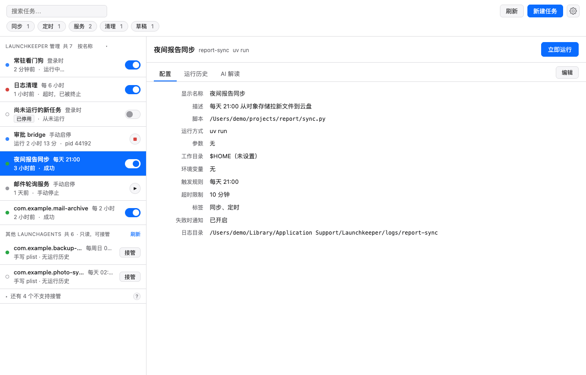
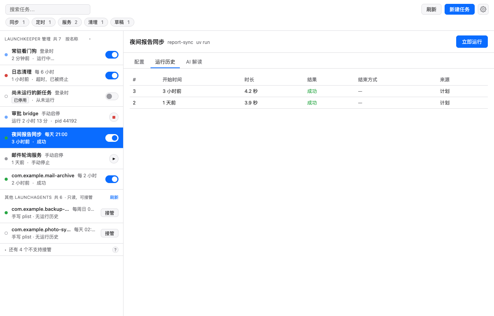
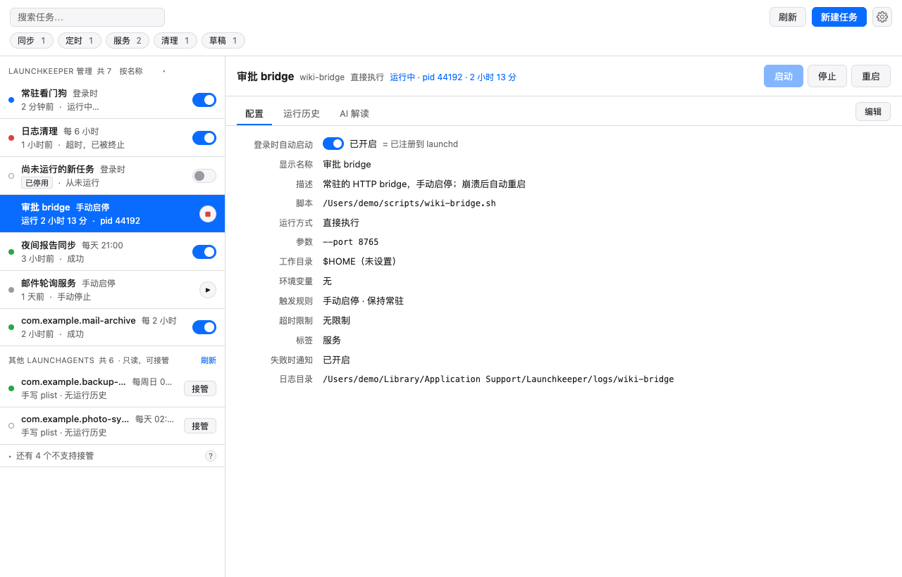
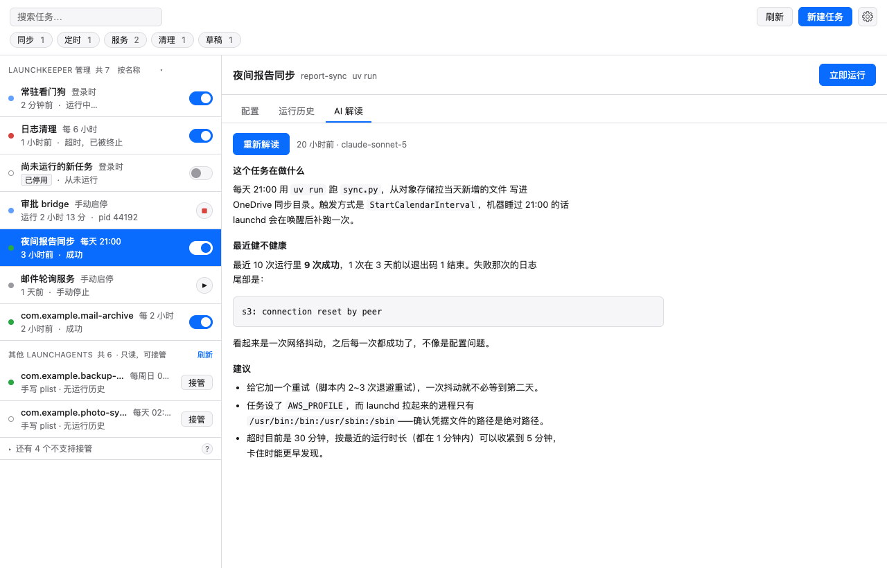
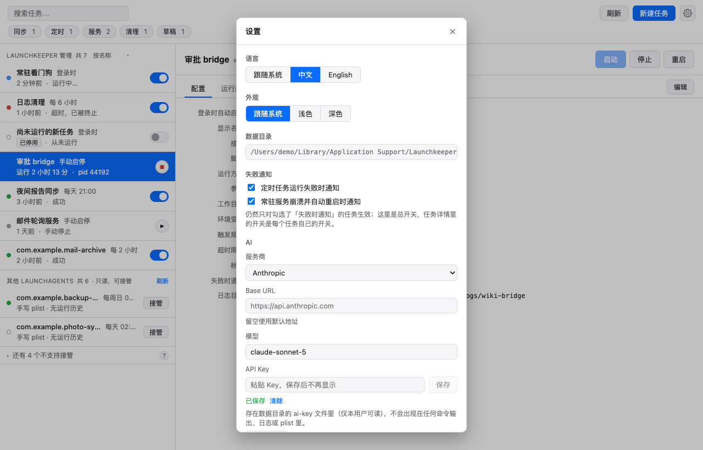
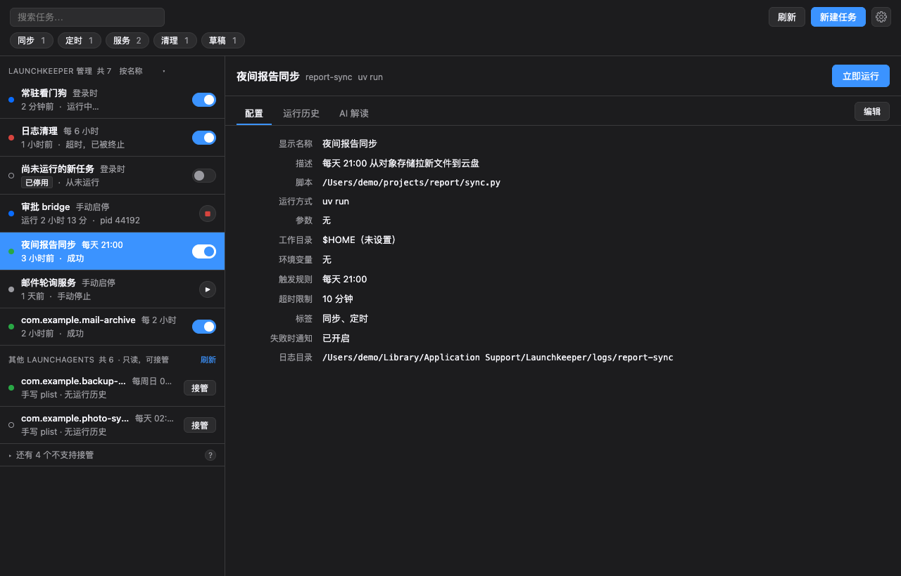
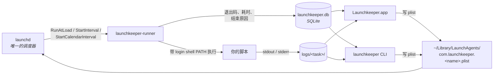

# Launchkeeper

**一个 macOS 原生应用和命令行工具，管理基于 `launchd` 的定时脚本和后台服务。看清每个任务什么时候跑的、为什么失败、跑了多久，一行 plist 都不用手写。**

[](https://github.com/code-better-life/launchkeeper/releases/latest)
[](https://github.com/code-better-life/launchkeeper/actions/workflows/ci.yml)


[](LICENSE)

[English](README.md) | 简体中文

[安装](#安装) · [快速上手](#快速上手) · [功能](#功能) · [工作原理](#工作原理) · [给 AI 助手](#给-ai-助手) · [常见问题](#常见问题) · [CLI 参考](docs/CLI.md)



## 为什么不直接用 cron 或者手写 plist？

- **Launchkeeper 自己不留任何常驻进程。** 你选的每条触发规则都会变成真正的 launchd plist 键。没有守护进程，没有定时循环，没有必须一直活着的菜单栏进程。**关掉应用，任务照跑。**
- **每一次运行都有记录。** 退出码、耗时、结束原因（正常退出 / 被信号杀掉 / 超时），以及这一次运行完整的 stdout / stderr。不用再写 `>> ~/some.log 2>&1` 然后按时间戳翻日志。
- **兼容你已经有的东西。** 机器上所有 LaunchAgent 都会列出来。你手写的那些可以原地接管，先备份成 `.bak`，一条命令还原。
- **命令行是一等公民。** 和应用共用同一个核心，每个命令都有 `--json`，AI 助手用 `launchkeeper docs` 就能读到完整参考。

## 安装

需要 macOS 13 Ventura 或更新。预编译的应用只支持 Apple Silicon；Homebrew formula 会在任何 Mac 上从源码构建 CLI。

**Homebrew**

```bash
# 应用（内含 CLI）
brew install --cask code-better-life/launchkeeper/launchkeeper

# 只装 CLI：launchkeeper + launchkeeper-runner + shell 补全
brew install code-better-life/launchkeeper/launchkeeper
```

**直接下载：** 从 [Releases](https://github.com/code-better-life/launchkeeper/releases/latest) 下载 `Launchkeeper_<version>_aarch64.dmg` 或 CLI 压缩包，把应用拖到 `/Applications`。

> **首次打开。** 当前版本还没有 Apple Developer ID 签名，Gatekeeper 会拦住双击。只需一次：右键应用选 **打开**，或者执行 `xattr -d com.apple.quarantine /Applications/Launchkeeper.app`。Homebrew 用户可以在安装 cask 时加 `--no-quarantine`。这对隐私权限弹框的影响见[常见问题](#常见问题)。

## 快速上手

**一个每天跑的脚本，先立刻跑一次确认没问题：**

```bash
launchkeeper add daily-report --script ~/bin/report.sh --daily 08:00
launchkeeper enable daily-report
launchkeeper run daily-report          # 不用等到 08:00
launchkeeper runs daily-report --limit 1
launchkeeper logs daily-report --last 1
```

**一个手动启停的服务，崩了由 launchd 拉起来：**

```bash
launchkeeper add api-bridge --script ~/bin/bridge.py --manual --keep-alive
launchkeeper enable api-bridge
launchkeeper start api-bridge
launchkeeper status
```

**接管一个自己手写的 plist，先看 diff：**

```bash
launchkeeper agents                              # 找到 label
launchkeeper adopt com.example.daily --dry-run   # 逐键 diff，不写任何东西
launchkeeper adopt com.example.daily             # 先备份成 <plist>.bak，再改写
launchkeeper unadopt com.example.daily           # 用 .bak 还原
```

在应用里也是同样的流程：**+** 新建任务，开关启用，**立即运行**，然后看 **运行记录** 和 **日志** 两个标签页。

| 命令 | 作用 |
|---|---|
| `add <name> --script <path> <trigger>` | 新建任务：`-d` 每天、`-e` 每隔、`-w` 每周、`-M` 每月、`-m` 手动 / 服务、`--at-login` |
| `list` / `show <name>` | 任务列表（触发规则、状态、上次运行）/ 单个任务的完整定义 |
| `enable` / `disable` | 向 launchd 注册 / 注销 job |
| `run` / `start` / `stop` / `restart` | 立即触发定时任务 / 控制服务 |
| `runs` / `logs` / `status` | 运行历史 / 某次运行的 stdout 和 stderr / 在跑什么、谁失败了、下次是谁 |
| `agents` / `adopt` / `unadopt` | 机器上所有 LaunchAgent / 原地接管 / 交还 |
| `explain` | AI 解读任务及其最近的健康状况 |
| `plist` / `docs` / `ai-prompt` | launchd 会加载的确切 XML / 完整 CLI 参考 / 现成的助手提示词 |

简写：`ls`、`rm`、`on`、`off`、`st`、`log`。任何命令加 `--json`（`-j`）得到稳定的机器可读输出。完整参考、JSON 契约和退出码见 [docs/CLI.md](docs/CLI.md)。

## 功能

**调度**
- 五种触发方式：登录时、固定间隔、每天（可一天多次）、每周、每月。分别对应 `RunAtLoad`、`StartInterval`、`StartCalendarInterval`。
- 触发规则用人话显示，`launchkeeper plist <name>` 可以看确切的 XML。
- 超时：超过 `--timeout` 的运行会被杀掉并记为退出码 124，而不是一直挂着。

**服务**
- 没有调度的常驻进程：在应用、托盘菜单或命令行里启动 / 停止 / 重启。
- 可选 `KeepAlive`：崩溃后 launchd 拉起，Launchkeeper 会告诉你它拉过。
- 实时状态，带 pid 和运行时长。

**运行历史与日志**
- 每次运行的开始时间、退出码、耗时、结束原因。
- 每次运行独立的 stdout 和 stderr，运行中可以实时 tail。
- 非零退出、超时、崩溃重启时弹 macOS 通知。每类有全局开关，单个任务可单独关掉。

**已有的 LaunchAgent**
- `~/Library/LaunchAgents` 里的所有条目都会列出，可以启动、停止、立即运行。
- 原地接管：label 和路径不变，原文件存为 `.bak`，只改 `ProgramArguments`。`--dry-run` 看 diff，`unadopt` 还原。
- 应用、`.app` 包里的程序、Homebrew services 会被识别并保持只读。

**把脚本跑对**
- 根据 login shell 的 `PATH`、项目目录和 shebang 推断解释器：项目 `.venv`、看到 `pyproject.toml` + `uv.lock` 用 `uv run`、有 `package.json` 用 `node` / `bun` / `deno`，或者交给 launchd 直接执行。
- runner 注入你真实的 login shell `PATH`，解决"终端里能跑、launchd 下失败"这个经典问题。

**AI 解读**
- 让配置好的模型说明任务在干什么、最近健不健康、上次为什么失败。
- 每个任务存一份答案，下次打开立刻显示。重新生成需要明确 `--refresh`。
- 支持 Anthropic 和任何 OpenAI 兼容接口，包括本地 Ollama。

**应用**
- 菜单栏托盘：一眼看状态，常用任务一键触发 / 启停。
- 界面默认英文，在设置里可以切换成简体中文，切换立即生效、不用重启。浅色、深色或跟随系统外观。

## 截图

| | |
|---|---|
| **运行历史**：退出码、耗时、结束原因<br> | **服务任务**：启动 / 停止 / 重启，keep-alive<br> |
| **外部 agent**：`~/Library/LaunchAgents` 里的其他一切<br> | **AI 解读**：每个任务存一份<br> |
| **设置**：语言、外观、通知、AI<br> | **深色模式**<br> |

## 工作原理



从这张图推出三条规则，这就是整个设计：

- **`launchd` 是唯一的调度器。** Launchkeeper 从不跑自己的定时循环或后台守护进程。关掉应用，调度在 launchd 手里。
- **runner 是必经之路。** `ProgramArguments` 永远指向 `launchkeeper-runner`，从不直接指向你的脚本。运行历史和逐次日志正是靠这一点才可能。
- **launchd job 是真源。** SQLite 只存 launchd 没地方放的东西：描述、标签、运行历史、日志。任务是否启用是从 launchd 读回来的，不是从数据库。

Launchkeeper 只写自己拥有的 plist：`com.launchkeeper.` 前缀，或者接管时它加了 `LaunchkeeperManaged` 标记的那些。其他 LaunchAgent 一律只读。

## 给 AI 助手

CLI 就是为了让助手驱动而设计的：每个命令都有稳定的 `--json` 输出，退出码有文档，参考手册就在二进制里。

```bash
launchkeeper docs          # 打印 docs/CLI.md，机器上不需要有仓库
launchkeeper ai-prompt     # 打印给助手的系统提示词（--lang zh-CN|en）
```

把 `ai-prompt` 的输出粘到助手的系统提示词或 `CLAUDE.md` 里。它会告诉模型：先读 `launchkeeper docs`，永远用 `--json`，改完用 `runs` 和 `logs` 验证，不碰非 Launchkeeper 的 agent，破坏性操作先问人。

## 常见问题

**退出应用后我的任务怎么办？**
没有任何影响。它们本来就不是跑在应用里的。launchd 负责调度，runner 负责记录，应用关着的时候发生的一切下次打开都能看到。

**卸载 Launchkeeper 呢？**
它写的 plist 是普通的 LaunchAgent，launchd 照样认，但它们指向 `launchkeeper-runner`，所以删 runner 的话要一起删掉。`brew uninstall --zap` 会替你做：bootout 所有 `com.launchkeeper.*` job 并删除数据目录。接管来的 job 保留原 label，会被刻意留下。先 `launchkeeper unadopt <name>` 用 `.bak` 还原它们。

**为什么任务运行时 macOS 弹权限框？**
macOS 把桌面、文稿、外置盘的隐私（TCC）授权绑定在 launchd 执行的那个确切二进制上。在发布版带上稳定的 Developer ID 签名之前，重新编译或移动 `launchkeeper-runner` 都可能在下次任务触发时重新弹框。允许一次，二进制不变就一直有效。

**脚本在终端里能跑，launchd 下失败。**
launchd 启动进程时 `PATH` 极简（`/usr/bin:/bin:/usr/sbin:/sbin`），没有你 shell 里的任何环境变量。runner 会注入你 login shell 的 `PATH`。其他的，给任务加环境变量，或者问 `launchkeeper explain`，它会列出看到的变量名。

**数据目录能放外置盘吗？**
可以，用 `--data-dir`、`LAUNCHKEEPER_DATA_DIR` 或 `launchkeeper config data-dir`。唯一的例外是 `~/Library/Logs/Launchkeeper/`，那是 launchd 自己写 runner 的 stdout 的地方。`StandardOutPath` 在外置卷上 launchd 会拒绝启动 job，所以这个路径留在内置盘。

**支持 Intel Mac 吗？**
CLI 支持，Homebrew formula 或 `cargo build` 从源码构建。预编译的应用目前只有 Apple Silicon。

**Mac 睡着的时候错过了触发时间？**
日历触发（每天 / 每周 / 每月）唤醒后会补跑一次。间隔触发不会。这是 launchd 的行为，Launchkeeper 不改它。

## 数据与隐私

所有数据都在一个目录里，默认是 `~/Library/Application Support/Launchkeeper/`：

```
launchkeeper.db      SQLite：任务元数据、标签、运行历史、AI 解读
logs/<task>/         stdout 和 stderr，每次运行一对文件
bin/                 安装好的 launchkeeper-runner
ai.json              非敏感的 AI 设置：provider、base URL、model
ai-key               API key，文件权限 0600
```

**没有任何东西离开你的机器。** 没有遥测，没有崩溃上报，没有更新检查。唯一的例外是你自己配置的 AI 请求：`explain` 会把任务定义、最近 10 次运行和最新日志尾部（最多 16 KiB）发到*你的*端点、用*你的* key。**环境变量的值永远不会发送**，只发变量名。把 `--base-url` 指向本地 Ollama，连这一步都不出机器。Key 从 stdin 读取，不走命令行参数，不会进 shell 历史。

## 卸载

```bash
brew uninstall --zap --cask code-better-life/launchkeeper/launchkeeper   # 应用
brew uninstall --zap code-better-life/launchkeeper/launchkeeper          # CLI
```

手动卸载：接管过的先 `launchkeeper unadopt`，其余 `launchkeeper disable`，然后删除 `Launchkeeper.app`、`~/Library/LaunchAgents/com.launchkeeper.*.plist`、`~/Library/Application Support/Launchkeeper`、`~/Library/Logs/Launchkeeper` 和 `~/.config/launchkeeper`。

## 从源码构建

需要 Rust stable（edition 2024）；构建应用还需要 Node 22 和 pnpm。

```bash
git clone https://github.com/code-better-life/launchkeeper.git
cd launchkeeper

cargo build --release --workspace          # target/release/launchkeeper + launchkeeper-runner
pnpm -C crates/launchkeeper-app install
pnpm -C crates/launchkeeper-app tauri dev  # 或 tauri build
```

CLI 会在同目录找 runner，也可以用 `--runner` / `LAUNCHKEEPER_RUNNER` 指定。

```
crates/launchkeeper-core/     任务模型、plist 生成、launchctl 封装、SQLite 存储
crates/launchkeeper-runner/   launchd 拉起的薄二进制：跑脚本、抓日志、记结果
crates/launchkeeper-cli/      launchkeeper 二进制
crates/launchkeeper-app/      Tauri 2 桌面应用（Rust 后端 + Svelte 前端）
docs/                         设计文档和 CLI 参考
```

## 参与贡献

欢迎 issue 和 pull request，尤其是你踩到的 launchd 边角情况和翻译修正。

- 先读 [CLAUDE.md](CLAUDE.md)，很短，不可协商的设计规则都在那里。
- 新行为要带测试。`launchkeeper-core` 覆盖率目标 80%。
- **任何会写 plist 或调 `launchctl` 的测试必须把 `LAUNCHKEEPER_DATA_DIR`、`LAUNCHKEEPER_LAUNCH_AGENTS_DIR`、`LAUNCHKEEPER_RUNNER_LOG_DIR` 指到临时目录**，并用一次性 label 且测试结束后清理。只重定向数据目录不够，启用状态检查读的是真实的 `~/Library/LaunchAgents`。
- `cargo fmt`、`cargo clippy -- -D warnings`、`cargo test --workspace` 必须通过。提交信息格式 `<type>: <description>`。

## 路线图

- 签名并 notarize 的发布版，让 Gatekeeper 直接放行、TCC 授权跨更新保留。
- tap 稳定后提交 homebrew-core / homebrew-cask。
- 讨论中：`WatchPaths`（文件变化触发）和任务依赖（A 成功后跑 B）。

## 许可证

MIT，见 [LICENSE](LICENSE)。
