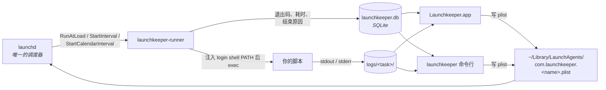

# Launchkeeper

[English](README.md) | 简体中文

**看清 Mac 上每一个定时脚本：它什么时候跑的、为什么失败、跑了多久——一行 plist 都不用手写。**


Launchkeeper 是一个 macOS 原生应用（外加一个同等地位的命令行工具），用来管理基于 `launchd` 的自动化：定时脚本、登录项、常驻后台服务。它不重新造调度器——真正的调度始终由 `launchd` 完成——它做的是在上面加一层界面、运行历史和日志。

## 为什么用 Launchkeeper

**`launchd` 是唯一的调度器，我们自己不留任何常驻进程。**
你选的每一条触发规则——登录时、每 N 分钟、每天 / 每周 / 每月某个时间——都会被翻译成真正的 launchd plist 键（`RunAtLoad`、`StartInterval`、`StartCalendarInterval`）。没有 Launchkeeper 守护进程，没有定时循环，也没有必须一直活着的菜单栏进程。**关掉应用，任务照跑**，因为它们本来就不是跑在应用里的。哪怕把 Launchkeeper 卸了，剩下的 plist launchd 依然认。

**每一次运行都被记下来，而不只是「跑过了」。**
任务的 plist 从不直接指向你的脚本，而是指向 `launchkeeper-runner`——一个很薄的二进制，它执行脚本并记录发生了什么：开始时间、**退出码**、**耗时**、**结束原因**（正常退出 / 被信号杀掉 / 超时被杀），以及这一次运行完整的 stdout / stderr。不用再写 `>> ~/some.log 2>&1` 然后按时间戳翻日志。超过 `--timeout` 的运行会被杀掉并记为退出码 124，而不是一直挂着。

**不只有定时，还有服务。**
任务可以是一个*服务*：没有任何调度，由你在应用里、托盘菜单里或命令行里**启动 / 停止 / 重启**的常驻进程。打开 keep-alive，进程崩溃后 launchd 会把它拉起来——而且 Launchkeeper 会告诉你它拉过，而不是让它在后台无声地反复重启。

**已经手写好的 plist，可以原地接管。**
Launchkeeper 会列出 `~/Library/LaunchAgents` 里的所有 LaunchAgent，不只是自己的，并且对其中任何一个都能启停、立即运行。对你自己手写的那些，它提供**接管**：label 和文件路径原封不动，先把原文件复制成 `<plist>.bak`，只把 `ProgramArguments` 改成经过 runner。从此这个 job 和别的任务一样有运行历史和日志。写入前会展示逐键 diff（`--dry-run`），**`unadopt` 用 `.bak` 一键还原**。凡是看起来不像用户脚本的——应用、`.app` 包里的程序、Homebrew services——一律只读。

**它知道你的脚本该怎么跑。**
把 `report.py` 指给它，它会扫你 login shell 的 `PATH`、项目目录和文件的 shebang，推荐合适的运行方式：项目里的 `.venv/bin/python`、看到 `pyproject.toml` + `uv.lock` 就首推 `uv run`、有 `package.json` 就是 `node` / `bun` / `deno`，或者干脆交给 launchd 直接执行。它还顺手解决了写第一个 plist 必踩的坑：launchd 给进程的 `PATH` 极简、没有 Homebrew，而 runner 会把你真实的 login shell `PATH` 注入进去。

**失败通知。**
定时任务非零退出或超时会弹 macOS 通知，keep-alive 服务崩溃重启也会。两类各有全局开关，单个任务也可以单独关掉。

**AI 解读，一次生成反复看。**
让配置好的模型说明这个任务到底在干什么、最近健不健康、昨晚那次为什么失败。结果**按任务存下来**，下次打开立刻显示，重新生成需要你明确 `--refresh` 或点一下按钮。发出去的内容是任务定义、最近 10 次运行和最新日志的尾部；**环境变量的值永远不会被发送**，只发变量名。

**中英文界面，浅色 / 深色。**
默认跟随系统语言，设置里可切换，立刻生效、不用重启。外观支持浅色、深色和跟随系统。

**为脚本和 AI 助手而生的 CLI。**
`launchkeeper` 不是事后包一层的壳——它和应用共用同一个核心，每个命令都有稳定的 `--json` 输出、子命令简写（`ls` / `rm` / `on` / `off` / `st` / `log`）、能补全任务名的 shell 补全，以及有文档的退出码。`launchkeeper docs` 直接从二进制里打印完整的 CLI 参考（机器上不需要有仓库），`launchkeeper ai-prompt` 打印一段可以直接粘贴的提示词，让助手第一次就用对。

## 核心功能

- **任务列表**——名称、人话描述的触发规则、上次运行状态、启用开关、标签、搜索。
- **五种触发方式**——登录时、固定间隔、每天（可一天多个时间点）、每周、每月。
- **服务型任务**——手动启动 / 停止 / 重启，可选 `KeepAlive` 崩溃重启，实时状态（运行中 / 已停止 / 重启中）带 pid 和运行时长。
- **运行历史**——每次运行的开始时间、退出码、耗时和结束原因。
- **每次运行的日志**——单次运行的 stdout 和 stderr，在应用里或用 `launchkeeper logs` 看，运行中支持实时 tail。
- **外部 agent**——其余 LaunchAgent 只读展示，可启停，可接管的会标出来。
- **接管 / 撤销接管**——原地接管，带 `.bak` 备份和完整的撤销。
- **解释器发现**——`uv run`、项目 `.venv`、`node`、`bun`、`deno`、shebang，或 launchd 直接执行。
- **失败通知**——两类通知各有全局开关，可按任务关闭。
- **AI 解读**——每个任务一条持久化的解读，Markdown 渲染，`--refresh` 重新生成。
- **菜单栏托盘**——一眼看到状态，不打开窗口就能触发或启停收藏的任务。
- **对 AI 友好的 CLI**——处处 `--json`、`launchkeeper docs`、`launchkeeper ai-prompt`、`launchkeeper plist <name>` 打印 launchd 真正会加载的 XML。

## 截图

| | |
|---|---|
| **任务详情**——只读地展示 launchd 实际会做什么<br> | **运行历史**——退出码、耗时、结束原因<br> |
| **AI 解读**——每个任务一条存下来的解读<br> | **服务型任务**——启动 / 停止 / 重启，keep-alive<br> |
| **外部 agent**——`~/Library/LaunchAgents` 里的其他条目<br> | **设置**——语言、外观、通知、AI<br> |

深色模式：


## 安装

> **随首个 release 提供。** 在那之前请[从源码构建](#从源码构建)。

**应用（dmg）**——从 [Releases](https://github.com/code-better-life/launchkeeper/releases) 下载最新的 `Launchkeeper.dmg`，拖进 `/Applications`。

**Homebrew**

```bash
# 桌面应用
brew install --cask code-better-life/launchkeeper/launchkeeper

# 只装命令行（launchkeeper + launchkeeper-runner + shell 补全）
brew install code-better-life/launchkeeper/launchkeeper
```

### 首次打开：目前是 ad-hoc 签名

这些构建暂时还没有 Apple Developer ID 证书，所以双击时 macOS Gatekeeper 会拒绝打开。装好之后做一次就行：**右键点应用 → 打开**并确认，或者去掉隔离属性：

```bash
xattr -d com.apple.quarantine /Applications/Launchkeeper.app
```

用 Homebrew 的话一步到位：`brew install --cask --no-quarantine code-better-life/launchkeeper/launchkeeper`。

由此带来一个需要知道的后果：macOS 的隐私（TCC）授权是绑定到 launchd 执行的那个确切二进制上的——桌面、文稿、外置卷都是。没有稳定的 Developer ID 签名时，**重新编译或移动 `launchkeeper-runner` 会让下一次任务触发时重新弹授权框**。签名并 notarize 的发布版已在路线图上，之后这些授权就能一直有效。

## 快速上手

### 命令行

| 命令 | 作用 |
|---|---|
| `launchkeeper add <name> --script <path> <触发>` | 新建任务（`-d` 每天、`-e` 每隔、`-w` 每周、`-M` 每月、`-m` 手动 / 服务、`--at-login` 登录时） |
| `launchkeeper list`（`ls`） | 列出任务，带触发规则、状态和上次运行 |
| `launchkeeper show <name>` | 单个任务的完整定义 |
| `launchkeeper enable` / `disable`（`on` / `off`） | 向 launchd 注册 / 注销这个 job |
| `launchkeeper run <name>` | 立刻触发一次定时任务 |
| `launchkeeper start` / `stop` / `restart <name>` | 控制服务型任务 |
| `launchkeeper runs <name>` | 运行历史：退出码、耗时、结束原因 |
| `launchkeeper logs <name>`（`log`） | 某次运行的 stdout / stderr（`--last N`、`--err`、`--tail N`） |
| `launchkeeper status`（`st`） | 什么在跑、什么失败了、下一次什么时候 |
| `launchkeeper agents` | 机器上所有 LaunchAgent，标出能否接管 |
| `launchkeeper adopt <label>` / `unadopt <name>` | 原地接管一个手写 plist，或还给它 |
| `launchkeeper explain <name>` | AI 解读任务本身和最近的健康状况 |
| `launchkeeper plist <name>` | launchd 真正会加载的那份 XML |
| `launchkeeper docs` / `ai-prompt` | 完整 CLI 参考 / 现成的助手提示词 |

任何一条加上 `--json`（`-j`）都会输出稳定的机器可读结构。完整参考、JSON 契约和退出码见 [docs/CLI.md](docs/CLI.md)。

**建一个每天跑的任务，先手动跑一次确认没问题：**

```bash
launchkeeper add daily-report --script ~/bin/report.sh --daily 08:00
launchkeeper enable daily-report
launchkeeper run daily-report          # 不用等到 08:00
launchkeeper runs daily-report --limit 1
launchkeeper logs daily-report --last 1
```

**一个手动启停的服务，崩了自动重启：**

```bash
launchkeeper add api-bridge --script ~/bin/bridge.py --manual --keep-alive
launchkeeper enable api-bridge
launchkeeper start api-bridge
launchkeeper status --json
launchkeeper stop api-bridge
```

**接管一个自己手写的 plist，先看 diff：**

```bash
launchkeeper agents                              # 找到 label
launchkeeper adopt com.example.daily --dry-run   # 逐键 diff，什么都不写
launchkeeper adopt com.example.daily             # 先备份成 <plist>.bak，再改写
launchkeeper unadopt com.example.daily           # 用 .bak 还原
```

**问问它为什么失败：**

```bash
launchkeeper ai config --provider anthropic --model claude-sonnet-5
echo "$MY_API_KEY" | launchkeeper ai key set
launchkeeper ai test
launchkeeper explain daily-report            # 存下来了，再看不花钱
launchkeeper explain daily-report --refresh  # 重新生成
```

### 桌面应用（开发模式）

```bash
pnpm -C crates/launchkeeper-app install
pnpm -C crates/launchkeeper-app tauri dev
```

## 工作原理



这张图里有三条规则，它们就是整个设计：

- **`launchd` 是唯一的调度器。** Launchkeeper 绝不自己跑定时循环或常驻守护进程。关掉应用，调度还在 launchd 手里。
- **runner 是必经之路。** `ProgramArguments` 永远指向 `launchkeeper-runner`，从不直接指向你的脚本——正是这一点让运行历史和单次日志成为可能。
- **launchd job 是真源，SQLite 只存 launchd 没地方放的东西**——描述、标签、运行历史、日志。任务是否启用是从 launchd 读回来的，不是从数据库。

Launchkeeper 只写自己的 plist：`com.launchkeeper.` 前缀的，或者接管时（在把原文件备份成 `.bak` 之后）由它写入 `LaunchkeeperManaged` 标记的那些。其余 LaunchAgent 一律只读展示。

## 给 AI 助手

`launchkeeper`（命令行二进制，crate 名仍是 `launchkeeper-cli`）是 `launchkeeper-core` 的一等公民接口，面向脚本和 AI 助手。所有会改动状态的命令，加上 `list`、`show`、`runs`、`status`、`logs`，都有稳定的 `--json` 结构——完整的线上契约、退出码约定、子命令简写、shell 补全和触发标志语法见 [docs/CLI.md](docs/CLI.md)。`plist <name>` 打印 launchd 真正会加载的那份 XML，方便脚本或助手检查和排错。

有两个子命令是专门为助手准备的：

- `launchkeeper docs` 打印完整的 `docs/CLI.md`，编译时嵌在二进制里——机器上不需要有仓库。
- `launchkeeper ai-prompt [--lang zh-CN|en]` 打印下面这段提示词，不用你手打。

把它粘到助手的系统提示、你的 `CLAUDE.md` 或者对话里：

```
本机安装了 Launchkeeper：一个基于 macOS launchd 的定时任务与常驻服务管理器，命令行工具是 `launchkeeper`。
动手之前，先运行 `launchkeeper docs` 读完整的 CLI 参考（子命令、参数、JSON 输出结构）。
约定：
- 只读命令一律加 `--json` 并解析结构化输出，绝不解析给人看的文本。
- 用 `launchkeeper add` 建任务：脚本路径给 `--script`，一般让它自己推断运行方式；触发用 `-d`（每天某个时间）/ `-e`（每隔多久）/ `-m`（手动启停的服务）。
- 改动之前先 `launchkeeper show <name> --json` 看当前定义，改完用 `launchkeeper runs <name>` 和 `launchkeeper log <name>` 验证。
- 只碰 Launchkeeper 管理的任务；`launchkeeper agents` 列出的其他 LaunchAgent 都是只读的，除非用户要求接管。
- 任何破坏性操作（rm、unadopt、off）之前先问用户。
```

## 数据与隐私

Launchkeeper 存的所有东西都在同一个目录里，默认是 `~/Library/Application Support/Launchkeeper/`：

```
launchkeeper.db      SQLite：任务元数据、标签、运行历史、AI 解读
logs/<task>/         stdout 和 stderr，每次运行一对文件
bin/                 安装好的 launchkeeper-runner 副本
ai.json              非敏感的 AI 配置：提供方、Base URL、模型名
ai-key               API Key，文件权限 0600
```

位置可以用 `--data-dir`、`LAUNCHKEEPER_DATA_DIR`，或 `~/.config/launchkeeper/data-dir` 里的一行路径覆盖（优先级从高到低如此；`launchkeeper config data-dir` 负责读写这个文件）。唯一的例外是 `~/Library/Logs/Launchkeeper/`，launchd 自己会把 runner 的 stdout 写在那里——launchd 拒绝启动 `StandardOutPath` 在外置卷上的 job，所以这个路径没法跟着数据目录走。

**没有任何数据离开你的机器**——没有埋点、没有崩溃上报、没有更新检查。唯一的例外是你自己配置的 AI 请求：`explain` 会把任务定义、最近 10 次运行和最新日志尾部（最多 16 KiB）发到*你*的 endpoint、用*你*的 key。**环境变量的值永远不会被包含在内**，只发变量名——因为「为什么在我 shell 里好好的、到 launchd 下就挂」的答案通常就在变量名里。把 `--base-url` 指向本地 Ollama 的话，连这一次请求也不出本机。API Key 以 0600 权限写在 `<data_dir>/ai-key`，且只从 stdin 读取，绝不走命令行参数——那会留在 shell 历史和 `ps` 输出里。

## 从源码构建

需要 Rust stable（edition 2024）；构建桌面应用还需要 Node 22 和 pnpm。

```bash
git clone https://github.com/code-better-life/launchkeeper.git
cd launchkeeper

# 命令行 + runner
cargo build --release --workspace
# -> target/release/launchkeeper 和 target/release/launchkeeper-runner
#    （CLI 会把 runner 当同目录的兄弟二进制找，也可以用 --runner / LAUNCHKEEPER_RUNNER 指定）

# 桌面应用
pnpm -C crates/launchkeeper-app install
pnpm -C crates/launchkeeper-app tauri build
```

目录结构：

```
crates/launchkeeper-core/     任务模型、plist 生成、launchctl 封装、SQLite 存储
crates/launchkeeper-runner/   被 launchd 真正拉起的薄二进制：执行脚本、捕获日志、记录结果
crates/launchkeeper-cli/      launchkeeper 二进制（crate 名不变：launchkeeper-cli）
crates/launchkeeper-app/      Tauri 2 桌面应用（Rust 后端 + Svelte 前端）
docs/                         PRD 与设计文档
```

提交之前：`cargo fmt`、`cargo clippy -- -D warnings`、`cargo test --workspace` 都要通过。

## 参与贡献

欢迎 issue 和 PR——尤其欢迎 bug 报告、你踩到的 launchd 边角情况，以及翻译修正。

- 先读 [CLAUDE.md](CLAUDE.md)，它很短，写着那几条不可协商的设计规则（launchd 是唯一的调度器、runner 是必经之路、只写自己的 plist）。
- 新行为要带测试，`launchkeeper-core` 的覆盖率目标是 80%。
- **任何会写 plist 或调 `launchctl` 的测试，必须把 `LAUNCHKEEPER_DATA_DIR`、`LAUNCHKEEPER_LAUNCH_AGENTS_DIR`、`LAUNCHKEEPER_RUNNER_LOG_DIR` 都指到临时目录**，并使用一次性的 label、测完清理干净。只重定向数据目录是不够的——启用状态的检查会去读真实的 `~/Library/LaunchAgents`。
- 提交信息格式 `<type>: <description>`，type 取 `feat` / `fix` / `refactor` / `docs` / `test` / `chore` / `perf` / `ci`。

## 路线图

- [x] **M1** —— 核心库、runner 和 CLI。
- [x] **M2** —— 桌面应用：任务列表、详情、立即运行、日志查看、菜单栏托盘。
- [x] **M2.5** —— 服务型任务：手动启停 + 崩溃自动重启。
- [x] **M3** —— 解释器发现、CLI 改名与简写、原地接管现有 LaunchAgents、失败通知、中英文界面。
- [ ] **M3（剩余）** —— 签名与 notarize、Homebrew tap、GitHub Actions。
- [ ] **M4** —— AI 解读 ✅、列表排序、分类数量统计。

## 许可证

MIT，见 [LICENSE](LICENSE)。

## 支持

如果 Launchkeeper 对你有用，可以请我喝杯咖啡：https://buymeacoffee.com/<TODO-handle>
